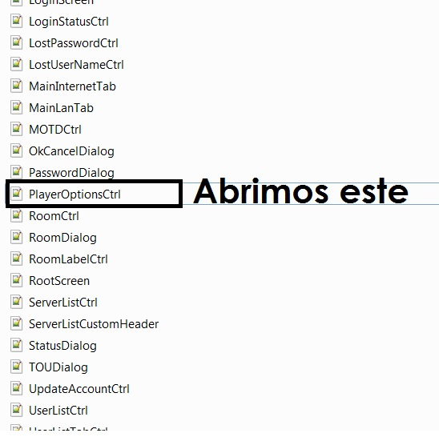
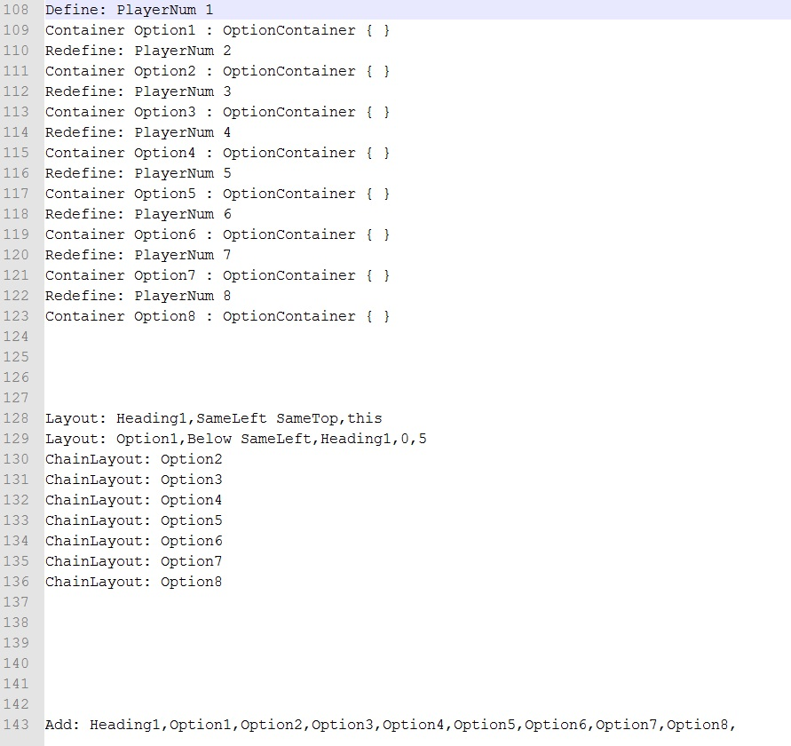
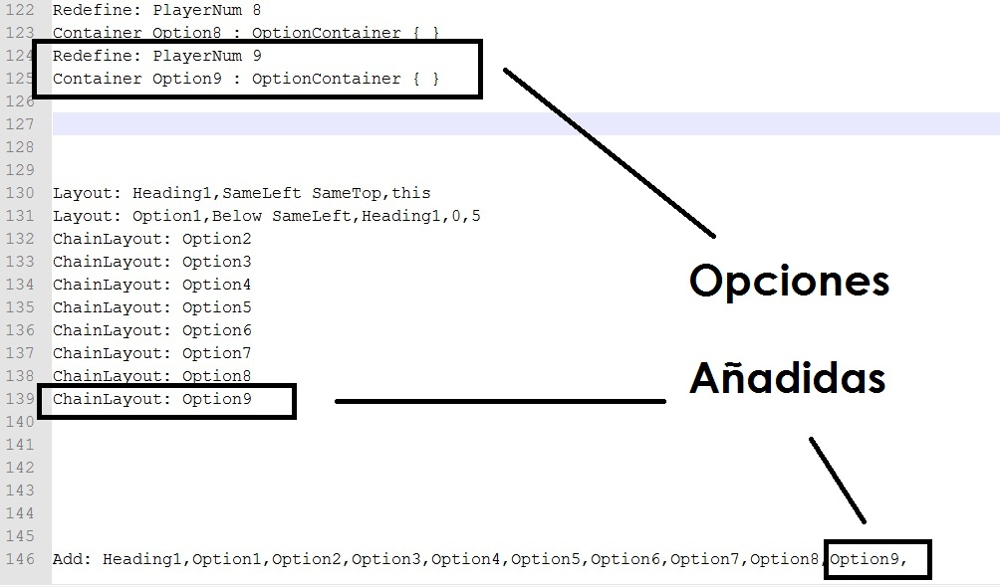
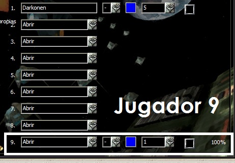

# Possibility of increase of 8-16 Players (Tutorial to investigate)

## Instructions

### 1. Step

For this we go to EE-AOC folder \ Data \ WONLobby Resources in here and look down below this file: (PlayerOptionsCtrl.cfg)

<insert picture_AoC8-16_1.png>  

We opened with a powerful editor such as notepad + + to facilitate the work.

### 2. Step

Let line 108 of the document and will appear to the 143 that will be final.

<insert picture_AoC8-16_2.png>  

### 3. Step

We add a new player, is the player 9 for we must supplement the information in all fields (You can copy information from the 8 and change it to 9).

<insert picture_AoC8-16_3.png>  

### 4. Step

Now we store the plain, unformatted and will open the EE-AOC.exe, go to multiplayer and create a game in LAN with the name you want.

As we will get the new player but a player will be added to us pudiendolo control and therefore will not work because it is not independent.

<insert picture_AoC8-16_4.png>  

### 5. Step

As curious EE-AOC editing with a hex editor, such Winhex on page 6842 met sonde section lists the players from 1 to 32 would indicate that it is possible to put 32 players max? Activate the form to play with more than 8, and with 16 players?**

---

**Here is the tutorial and this note to investigate and achieve increase the number of  players. :D**
