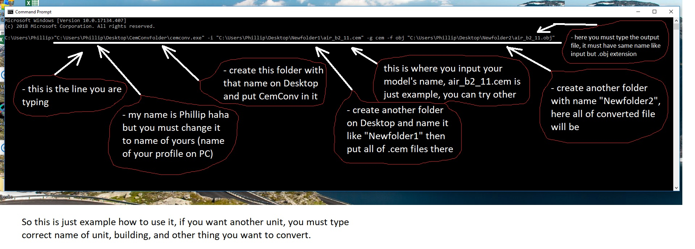
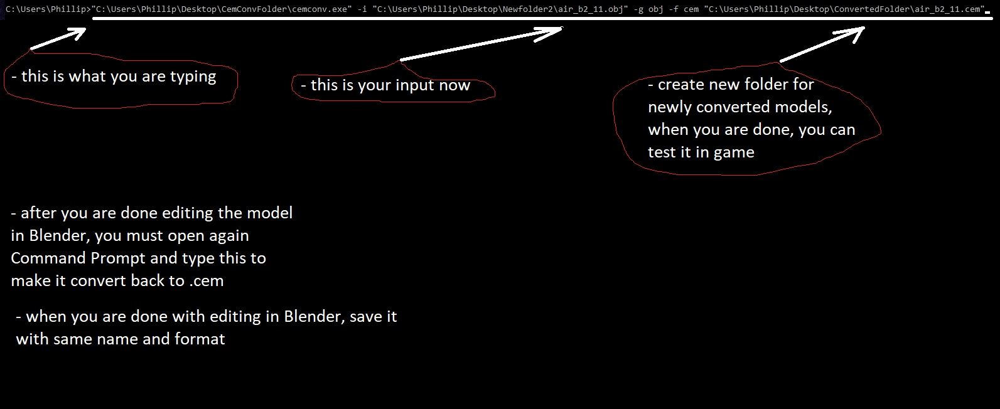

# Cemconv 0.2.3 tutorial (Windows)

By Philla007

## Instructions

### 1. Step

Open Command Prompt on your Windows.

### 2. Step

Follow procedure on first picture, from left to right:

<insert picture_First_part_of_CemConv.png>
    

### 3. Step

Follow procedure on second picture, from left to right:

<insert picture_Second_part_of_CemConv.png>
 

That's it. 
Have fun!

