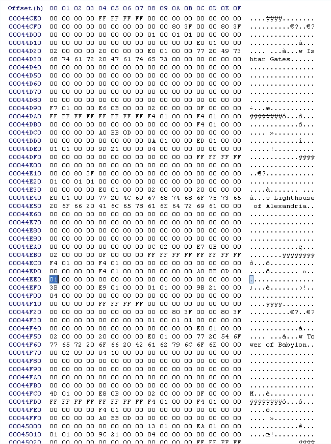
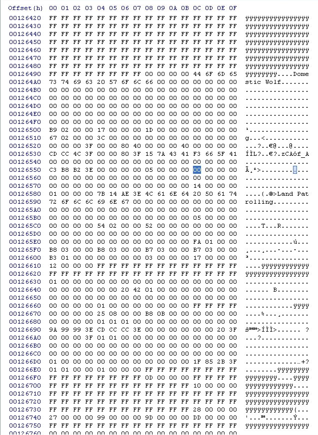
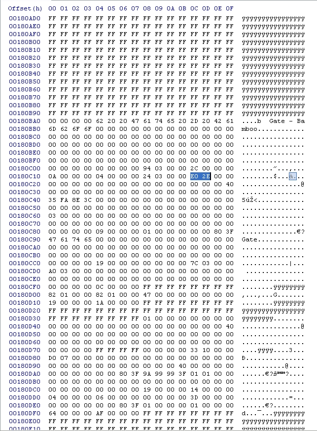
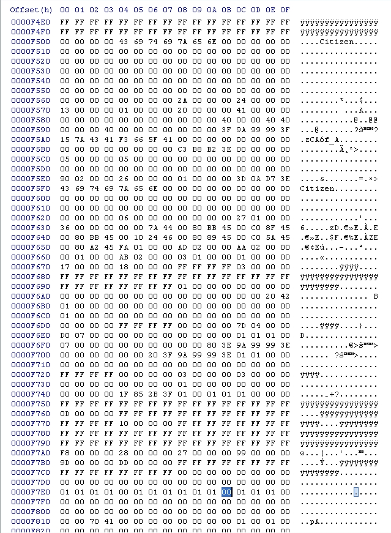
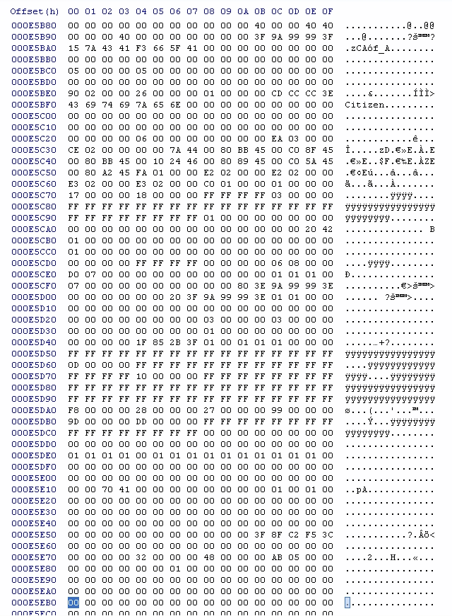
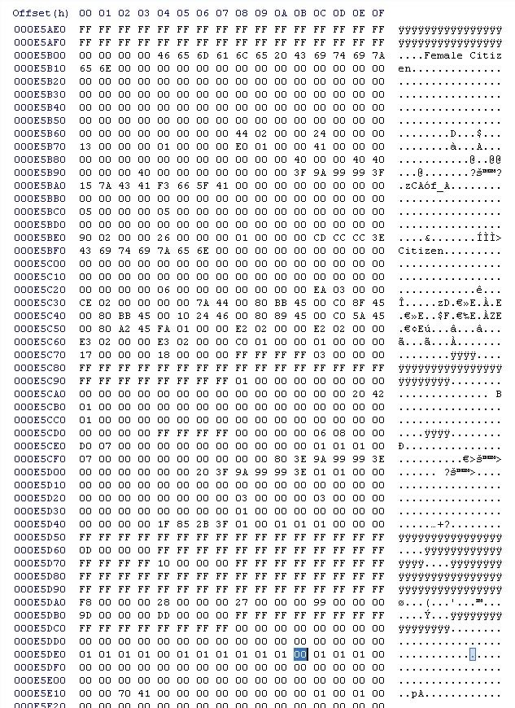
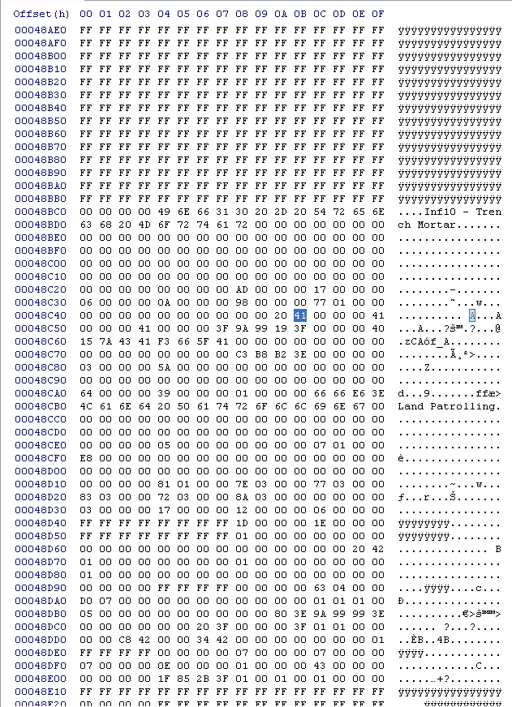
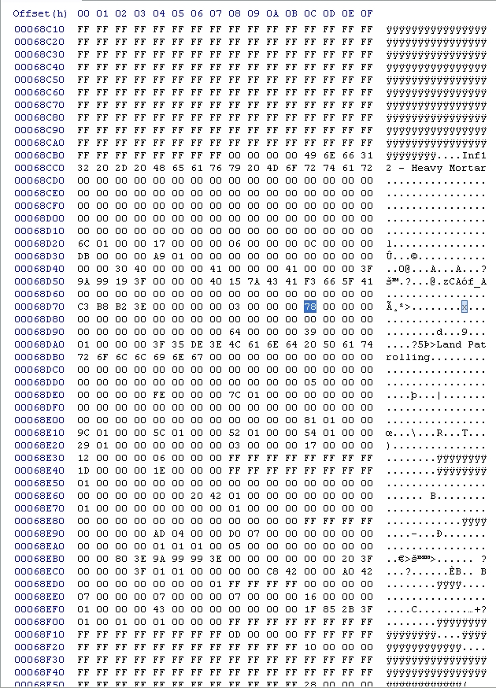

# BOOST15673's Hex editing guide
By BOOST15673

## Introduction
Upon request from shieldwolf23 I have made my own hex editing guide. I was originally against using a text guide seeing as I have a hard time explaining things, but I decided to do it either way. All of my knowledge comes from JCGF and only very little self taught. I used some of JCGF’s guides to teach myself a bit.

Used programs are:
- **HxD Hex Editor**
- **EE Unit**
- **Resource Hacker**

## Explanation of programs

Alright then, a little explanation over the programs first of all:
- **HxD Hex Editor** is as states a hex editor, but seeing as this is my first and currently only used hex editor, I can not confirm if it is suitable for beginners or not. Fact is, I started with no hexing knowledge with this program. It allows you to search for text, hex, floating integers and floating point numbers amongst various other useful things that I have seen but never used. I only use the search function for numbers and hex values though. It automatically makes a backup of the file you’re editing after each edit. I personally do not use this feature, I just back up the entire file from before editing it, and take note of what I changed and where.

- **EE Unit** is a program used to hex edit various features of units in the game, without the hassle of actual hex editing. Therefore, there are limitations that sometimes only actual hex editing can solve. This may only be the problem by me, but in case not, then now you know. I find it best to know how to use this program and a hex editor decently well, the two can support each other then. When you first open this program and set the paths, you will notice a colossal list of stuff right? Well, these are every single units, objects, buildings, upgrades, epochs and amongst some other things like calamities. These include units we know as the Canine Scout, and units we either don’t know or never see such as the most famous one “Homer”, no, not from The Simpsons, he is a prophet according to the game files. So here is what you can do no problem that at least by me, works without needing to do any hexing work: Edit all resource costs for any specified unit or building, even epochs! You can also edit the build speed, and by various units, the transport capacity and pop count. But by some buildings, like the airport, changing the capacity of planes that can be held (Noted as Transport Capacity in the program) you can not change it as it is grayed out. By cases like these, you must use a hex editor, or so I did. You may also change various other values in the objects editor proportion of the program, but I found only the transport cap and pop count to actually work. You may also add and remove units and technologies that buildings and units and such can create along with changing the command buttons, removing or adding up to a maximum of 10 buttons (By buttons the program means “Explore, Stop, Convert, etc”)

**Resource Hacker** is kinda hard to explain what it can all do. The only thing I use it for is changing text in the game, and I believe that that is the only thing it was meant to do. It can for example open your “Language.dll” file in your games’ main directory. In there you can change anything’s name that you see in game, meaning units, buildings, epochs, technologies, hell, by some things even stuff like what you see in the main menu! For example, I can confirm that you can do what I did in one of my updates I changed the “B-52 Bomber” to it’s official name “Boeing B-52 Stratofortress”. Now be aware, there is one downfall that I have yet to solve. If you give it a too long name, then when selecting the unit, you will notice in the “unit box” thing where it’s stats are, that the name gets cutoff. Yeah, that just means the name is too long. But do take note, I could be wrong as I only play in a resolution as the game box says “1024 x 768”, it may be cut off more, less or not all at different resolutions. After you edit something, you must click on “Compile Script” and then “Save” before doing anything else. Do NOT edit anything else or close the program before doing both. The program does remind you sometimes, but by me, it has forgotten sometimes, and well, I got a whole 2 hours of editing gone lost then. Yeah, don’t make this harsh mistake I made, TWICE!

That is, pretty much my explanation of the three programs I use, at least to the writing of this document.

Now I shall do my best to explain some hex editing as good as I can, explanations are my weak point, so please, tell me if something is explained incorrectly or in a not so understandable way.

Now, the thing about hex editing is you’re a programmer pretty much, if you can master this. You can do anything in the game, you can make anything happen, basically, your wildest dreams can come true, only limitations being the game engine, not being able to open certain files with hex editors, and copyrights disallowing you from editing certain programs, although that is usually only the .exe as you can make a virus then. Next page shows the next step.

## Instructions

### Step 1. (dbtechtree.dat):
So, simple thing is, not always, but to my knowledge and experience, USUALLY “00” means off or disabled, just like in binary code, which means “01” is on or enabled. So, you see here, I have the code for an object called “Lighthouse of Alexandria” well that is the thing with some names in hex, they are incorrect, or possibly the older later replaced names. This is actually the “Pharos Lighthouse”. Now, obviously, the only code it has is in “dbtechtree.dat” is from where it’s name is, to where the next objects’ name is. If you see a “w” before an objects’ name, in this case a building, then that means it is a Wonder. Now, from the values “77” to “the row below it “61”, I would highly recommend changing nothing. I used to think that I could change the name of the object like this, but that doesn’t work that way, I have found that this works by no object, so no need to change it, unless you don’t believe me and wanna try it out yourself.

Further more, you see these “FF” values are being reflected as these weird looking y’s. These are to my knowledge just “placeholders” and the game sees it as blank space and skips it. Correct me if I’m wrong. Now, you also see how I have highlighted a value “01”. That was a reference and or reminder for me. This value is usually “00”, can you guess what this means? No? Well that’s ok. You see, at the time of writing this document, I am making a realism mod for the game. And seeing as in reality, wonders like the Library of Alexandria do not have any special powers like in the game (Like being able to see every building in the world), I have decided to do the closest you can do to removing it from the game. I have made it a scenario only building. Changing this highlighted value from “00” to “01” like I did makes this happen. You can do the same for any scenario editor only object. BUT, only if it has a specified building way. For example the Mining Unit or Advanced Mining Unit will not appear as it is unbuildable, no building can produce it. You CAN however make a building build it through hex, but that is a bit complicated and for me, well I haven’t mastered it yet. If I ever update this document I may have it stated how to do so though ok? I have for example made it happen that the Engineer along with the Pillbox and Barbed Wire can be built in normal games, which includes multiplayer. The Engineer is built at the Barracks, and the Pillbox and Barbed Wire is built by him, so making these three objects not scenario editor only, was no hassle.

**NOTE:** I had to put the picture on the next page as in order to fit it below this text, it would be low quality and you wouldn’t be able to understand the numbers aka tell that they were numbers.

<insert picture_Boost1.png>  
  

### Step 2. (dbobjects.dat):

Now we shall not necessarily get any complexer, but do something that Sierra should’ve done in the first place. We shall make the Canine Scouts have an attack. Looking at the picture below, I have highlighted a “00”. Again, you see it is called a “Domestic Wolf”, and that there are many many other “00” values. Well, that just proves, that when I say it took me 2 hours to find this value, that I am not kidding. I couldn’t figure out what the name of the Canine Scout was in here. Now, this value alone (I am unsure if you can use the 00’s to the left and right of it as well) is for the attack, it is at 00 meaning it is disabled, hence in game it having no attack. Seeing as this is a wolf in game, I have decided to give it the same attack as the wolf. Now here’s where it gets quite annoying to figure out without a guide. You may think “Oh, let’s just change the value to 10, then it has 10 attack just like the wolf” Well, no, not even close, that would result in the Canine Scout having 16 attack. In order to give it 10 attack, you must change this value to “0A”. I am not going to list up the whole decimal – hex conversion table, because it is big. 

But here, this link is the one I use if I need some converting:
http://interstellar.com/support/Model_4201-B/Application_Notes/Decimal_To_Hex.txt 

If this link becomes broken or deleted for whatever reason, tell me and I will find a new one for you, or in the worst case scenario, write my own! Now if you’ve done this correctly, you will notice that in game, the Canine Scout CAN attack! The game does not crash as it HAS an attack animation, basically hinting at the fact that Sierra originally wanted to have the Canine Scout attack. BUT, there is one downfall which seems like a glitch, and probably why Sierra deleted it’s attack. It doesn’t matter if you attack or not, wild animals for some reason WILL attack your Canine Scout! Maybe this is just my game, but it will happen! So it’s a risk of it’s own for now, until somebody helps me solve this glitch…

<insert picture_Boost2.png>  
  

### Step 3. (dbobjects.dat):

Now here is where you must definitely need the link for conversion help unless you can remember this, although I think not, but who knows right? Now we shall edit the Health value from a gate, the Bamboo Gate to be specific. Looking at the picture below you see the highlighted value “E0 2E”. You cannot possibly guess what this means unless you use logic. But don’t try and figure it out yourself unless you wanna risk making a false calculation. The way to figure out this value is simple. In game, the gate has 12000 HP. Now, hex values only go up to 255, so you’re wondering “WHAT, IMPOSSIBLE! How do you get 12000 HP then?!” Well that is where hex gets you.

**What you have to do is simply described.** Going up in 256 increments, you must find the closest number below 12000, which is 11776. The hex value for 11776 is 2E, take not of this. Now you subtract 11776 from 12000 which gives you 224, in hex 224 has a value of E0. Now you simply change their positions! What I mean is not “2E E0” I would mean switching them like “E0 2E”.

So what I did was change the gate’s HP to the same as the gate, meaning it should have 4000 HP, using the method described above, you will see that you must change those two values (In the hex editor, the 12000 HP standard value should be “E0 2E”) to “A0 0F” and there you go, you have created “logic in EE”! Seriously, why do gates have more HP than walls?!

Still need help? Let the link explain it to you then:
http://interstellar.com/support/Model_4201-B/Application_Notes/Decimal_To_Hex.txt

<insert picture_Boost3.png>  
  

### Step 4. (dbobjects.dat):

Alright then, now we still don’t get complex, but do something that makes the game just SO SO much more realistic, well, at least with the limitations of EE. Now, we are gonna make the citizens including cyber citizens be able to **go through forests** and **walk up mountains**. Obviously, there is no mountain hiking feature or something similar in EE, they just walk. People could always go through forests, throughout humanity, and people could also get up mountains also, sure not always, but they figured out ways to do this, even in primitive Stone Ages and such. There is one drawback, you cannot edit any values for citizens or cyber citizens in certain epochs. It goes for all citizens and cyber citizens in every epoch there in. Meaning you couldn’t per se, make people learn to mountain climb in the Middle Ages onwards, but not any earlier, it’s either all epochs or none.

So the values are split between both the Male and Female citizens and cybers. Seen below, the first two pictures are the male citizens and cyber values for first, going through forests, and second, climbing up mountains. They are both “00” values right? Simply change them to “01” and there you go, now your male citizens and cyber citizens can go through forests and up mountains!

Same goes for pictures three and four, change the “00” to “01” and now your female citizens and cyber citizens can go through forests and up mountains! You see now how simple hex editing can be? Sometimes you change one value, other times, you change hundreds…

<insert picture_Boost4.png>  
  

<insert picture_Boost5.png>  
  

<insert picture_Boost6.png>  
  

<insert picture_Boost7.png>  
  

### Step 5. (dbobjects.dat):

Now we are gonna get very complex so complex that it’s baffled me and couple of the professional hex editors at EE Heaven! Now, in this picture you see a highlighted 41. This is supposedly the range value of the Trench Mortar. This alone. Now, the same by the Hand Cannoneer and Heavy Mortar, the first 41 you see besides any you may see in there name’s hex values. Just like in this photo. Those should be the range values, but they AREN’T! Well actually, they are only a **part** of it. You see, the Trench Mortar has a range of 10 in game, which in hex should be “0A”, but here you see, there is no 0A, ANYWHERE. Just 41, which in game SHOULD be 65 range. Now here’s the interesting thing, you change the value to 40, the range is then 3, change it to 42 and it is then 40!! Something isn’t right here, as you can see, this is one of the things that make hexing a challenge. When you find only part of a value, and even using logical methods, can’t find the other part. ARGH, well this is still useful info either way.

<insert picture_Boost8.png>  
  

### Step 6. (dbobjects.dat):

Now for another simple task. Here you have the attack value of the Heavy Mortar. 78 is in game 120. Change this to whatever you want to increase or decrease the attack, again, I am unsure if you can change the values to the left or right of the 78 in order to get massively high attack in game. You could do like I did and change it to 130 attack, simply change the 78 to 82 then and you’re done!

<insert picture_Boost9.png>  
  

## Conclusion

So for now, this is all I know about hexing, and all I have done. The rest that I have done, specifically making certain buildings build non-buildable units, I have forgotten, but do NOT worry! I will get back into that again in the future, and update this document ok? For example, what I have done, in case you didn’t know, is make the Golden Hind be built at the Docks in the corresponding age, it cannot be added, so I had to replace the Galleys there. But until I update this document with my way of explaining how to do it, download this file, it is alos a word document explaining how to replace units like I did with the Golden Hind, it does work since I used that exact document to do it back in 2011.

Umm, well, since I can’t find the original download link, I have decided to just attach it here. It should have come along with this document in the folder. I am NOT the owner or creator of it, until I find the original download link or the owner, I cannot properly credit the man who did it. This and ONLY this word document you are currently reading is mine, hence my name being in the document name.

**P.S.** - in future updates, I will try and make this document smaller, less pages, and smaller pictures with better quality, I know how annoying it is when one picture HAS to take up one page in order to be seen good enough. Forgive me for this and I will try to fix it in future updates, promised!

Last Updated:
January 8, 2013 @ 3:48 PM
