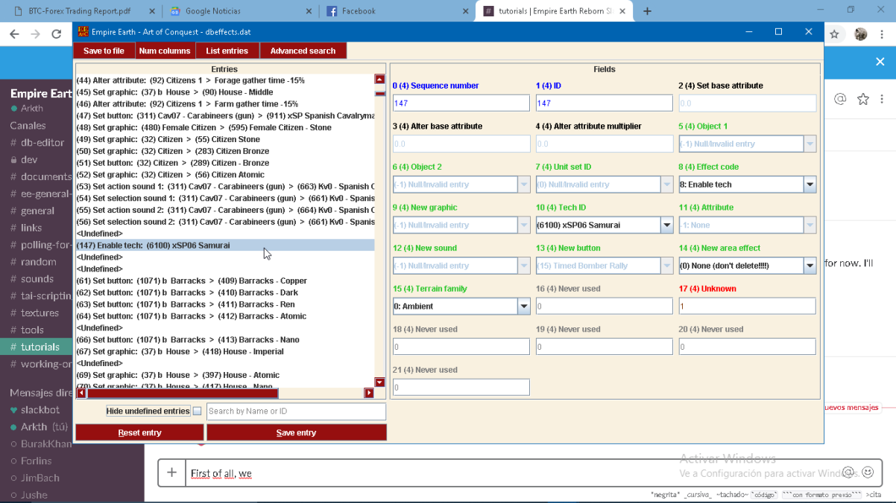
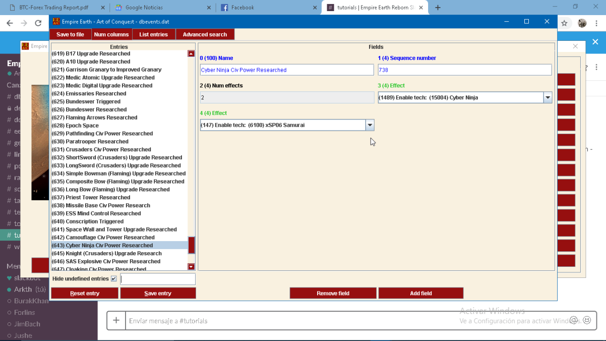
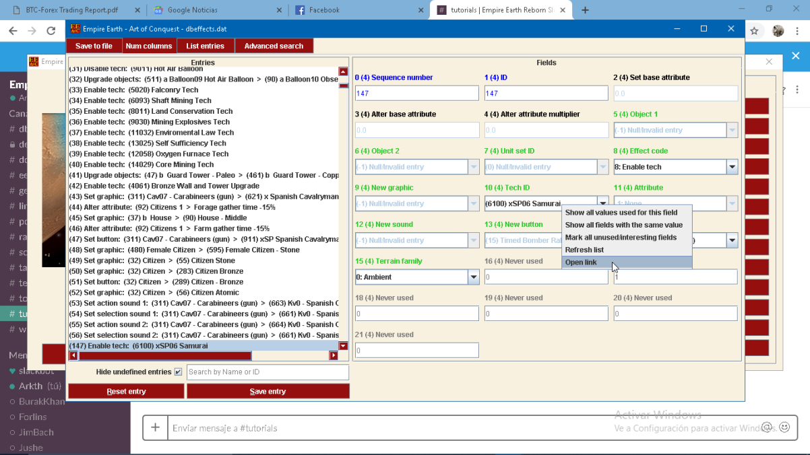
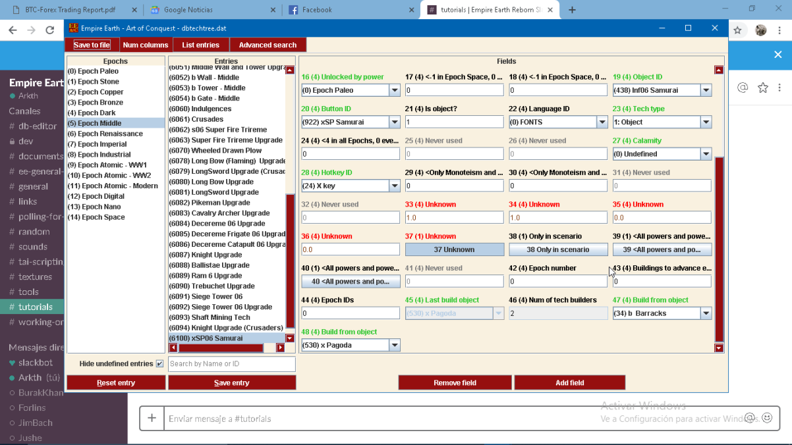
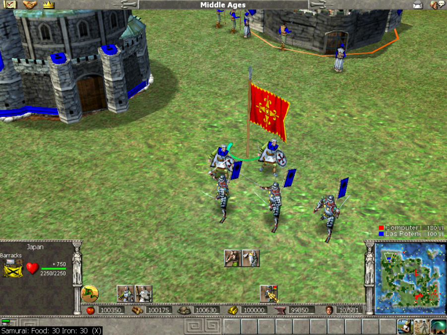

# How to add an existing unit to an existing civilization

By Arkth

## Introduction

Hi, and Welcome to this Quick Tutorial about "*How to add an existing unit to an existing Civilization*". Please excuse my english, but I'll try to explain myself the best I can - with screenshots. 

## Instructions

### 1. Step

 First of all, replace an "*undefined*" slot in **dbeffects.dat**. For this example I use the Samurai.

<insert picture_Arkth1.png>  
  

After that, we choose to Enable Tech: and picked the Samurai, as you can see in the image.

### 2. Step

Now with effect created, we add it to the **dbevents.dat**.

<insert picture_Arkth2.png>  
  

### 3. Step

We can go back to the **dbeffects** and jump to the Tech this way.

<insert picture_Arkth3.png>  
  

### 4. Step

Right there we disable fields 38, 39 and 40, related to Civ powers - because our handsome Samurai guy would be a Civ power now.

<insert picture_Arkth4.png>  
  

### Step 5.

And Voilá! As you can see, It's a normal game; We are Japan, Civ Power is Cyber Ninja; and we have this asian moderfookers right in the field!

<insert picture_Arkth5.png>  
  

Well, I hope you enjoyed this quicky sweety tutorial. 

**Remember:** The easiest path is sometimes the right path. That's all for today and see you in next episode of "Da Tutorials". Kisses! Cya! - Arkth
