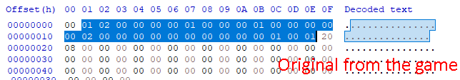

# SST Editing

by Skies
___
## Instruction
1. Open EE Studio and convet a **.sst** texture to **.tga**.

2. If there are some missing parts in the **.tga** texture, change the **.tga** resolution via a Hex Editor (I use HxD).

00 01 is 256; 00 02 is 512

3. Modify the **.tga** texture in a photo editing software and save the texture to **.tga**.

4. Open EE Studio and convert the new **.tga** texture to **.sst**.

5. Open the saved **.sst** texture in a Hex Editor and find the closest **“TRUEVISION-XFILE”** text string.

6. Delete all useless data after the text string.

7. Compare the new **.sst** header with the original one.

8. Make the new .sst header the same as the old one.

9. If your new texture was upscaled to a bigger resolution, change these blocks.

10. Save the **.sst** to: gamedirectory/Data/Textures

11. Done.

